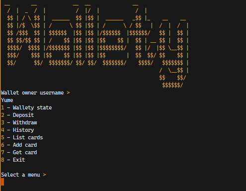

## Wallety

A Wallet Simulator program that allows you to perform almost any actions you would perform with a physical wallet.

**It has been implemented in four different languages:**

- [Rust](https://github.com/hei-school/my-wallet-YumeT023/tree/feature/rust)
- [Java](https://github.com/hei-school/my-wallet-YumeT023/tree/feature/java)
- [Typescript (deno)](https://github.com/hei-school/my-wallet-YumeT023/tree/feature/typescript)
- [Python](https://github.com/hei-school/my-wallet-YumeT023/tree/feature/python)

### Features

- Check your wallet state (funds, available space)
- Make deposit
- Make withdrawal
- List actions history (you may not be able to do this in reality:D)
- Add different type of card such as: _Bank card, National ID card, Driving license_
- Get the specified card
